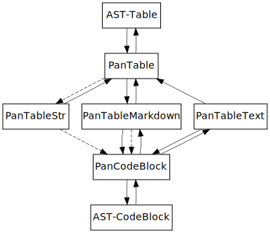
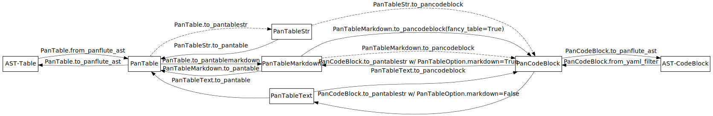

.. This is auto-generated from `docs/README.md`. Do not edit this file directly.

========================================================================================
Pantable—A Python library for writing pandoc filters for tables with batteries included.
========================================================================================

:Date:   November 30, 2021

.. contents::
   :depth: 3
..

+-------------+----------------------------------------------------------------------------------+
| docs        | |Documentation Status| |image2|                                                  |
+=============+==================================================================================+
| tests       | |GitHub Actions| |Coverage Status|                                               |
|             |                                                                                  |
|             | |Codacy Code Quality Status| |Scrutinizer Status| |CodeClimate Quality Status|   |
+-------------+----------------------------------------------------------------------------------+
| package     | |Supported versions| |Supported implementations| |PyPI Wheel|                    |
|             |                                                                                  |
|             | |PyPI Package latest release| |GitHub Releases| |Development Status| |Downloads| |
|             |                                                                                  |
|             | |Commits since latest release| |License|                                         |
+-------------+----------------------------------------------------------------------------------+
| conda-forge | |Conda Recipe| |Conda Downloads| |Conda Version| |Conda Platforms|               |
+-------------+----------------------------------------------------------------------------------+
| cite        | |DOI|                                                                            |
+-------------+----------------------------------------------------------------------------------+

Introduction
============

Pantable is a Python library that maps the pandoc Table AST to an internal structure losslessly. This enables writing pandoc filters specifically manipulating tables in pandoc.

This also comes with 3 pandoc filters, ``pantable``, ``pantable2csv``, ``pantable2csvx``.

``pantable`` is the main filter, introducing a syntax to include CSV table in markdown source. It supports all table features supported by the pandoc Table AST.

``pantable2csv`` complements ``pantable``, is the inverse of ``pantable``, which convert native pandoc tables into the CSV table format defined by ``pantable``. This is lossy as of pandoc 2.11+, which is supported since pantable 0.13.

``pantable2csvx`` (experimental, may drop in the future) is similar to ``pantable2csv``, but introduces an extra column with the ``fancy-table`` syntax defined below such that any general pandoc Table AST can be losslessly encoded in CSV format.

Some example uses are:

1. You already have tables in CSV format.

2. You feel that directly editing markdown table is troublesome. You want a spreadsheet interface to edit, but want to convert it to native pandoc table for higher readability. And this process might go back and forth.

3. You want lower-level control on the table and column widths.

4. You want to use all table features supported by the pandoc’s internal AST table format, which is not possible in markdown for pandoc (as of writing.)

A word on support
-----------------

Note that the above is exactly how I use pantable personally. So you can count on the round-trip losslessness. ``pantable`` and ``pantable2csv`` should have robust support since it has been used for years. But since pandoc 2.11 the table AST has been majorly revised. Pantable 0.13 added support for this new AST by completely rewriting pantable, at the same time addresses some of the shortcoming of the original design. Part of the new design is to enable pantable as a library (see `Pantable as a library <#pantable-as-a-library>`__ below) so that its functionality can be extended, similar to how to write a pandoc filter to intercept the AST and modify it, you can intercept the internal structure of PanTable and modify it.

However, since this library is completely rewritten as of v0.13,

-  ``pantable`` and ``pantable2csv`` as pandoc filters should be stable

   -  there may be regression, please open an issue to report this

-  round-trip losslessness may break, please open an issue to report this
-  ``pantable2csvx`` as pandoc filter is experimental. API here might change in the future or may be dropped completed (e.g. replaces by something even more general)
-  Pantable as a library also is experimental, meaning that the API might be changed in the future.

Installation
============

Pip
---

To manage pantable using pip, open the command line and run

-  ``pip install pantable`` to install

   -  ``pip install https://github.com/ickc/pantable/archive/master.zip`` to install the in-development version

-  ``pip install -U pantable`` to upgrade
-  ``pip uninstall pantable`` to remove

You need a matching pandoc version for pantable to work flawlessly. See `Supported pandoc versions <#supported-pandoc-versions>`__ for details. Or, use the `Conda <#conda>`__ method to install below to have the pandoc version automatically managed for you.

Conda
-----

To manage pantable **with a matching pandoc version**, open the command line and run

-  ``conda install -c conda-forge pantable`` to install
-  ``conda update pantable`` to upgrade
-  ``conda remove pantable`` to remove

You may also replace ``conda`` by ``mamba``, which is basically a drop-in replacement of the conda package manager. See `mamba-org/mamba: The Fast Cross-Platform Package Manager <https://github.com/mamba-org/mamba>`__ for details.

Note on versions
----------------

Supported Python versions
~~~~~~~~~~~~~~~~~~~~~~~~~

pantable v0.12 drop Python 2 support. You need to ``pip install pantable<0.12`` if you need to run it on Python 2.

To enforce using Python 3, depending on your system, you may need to specify ``python3`` and ``pip3`` explicitly.

Check the badge above or ``setup.py`` for supported Python versions, ``setup.py`` further indicates support of pypy in additional of CPython.

Supported pandoc versions
^^^^^^^^^^^^^^^^^^^^^^^^^

pandoc versioning semantics is `MAJOR.MAJOR.MINOR.PATCH <https://pvp.haskell.org>`__ and panflute’s is MAJOR.MINOR.PATCH. Below we shows matching versions of pandoc that panflute supports, in descending order. Only major version is shown as long as the minor versions doesn’t matter.

.. table:: Version Matching [1]_

   +----------+------------------+---------------------------+-------------------------------+
   | pantable | panflute version | supported pandoc versions | supported pandoc API versions |
   +==========+==================+===========================+===============================+
   | 0.14.1   | 2.1.3            | 2.11.0.4–2.16.x           | 1.22–1.22.1                   |
   +----------+------------------+---------------------------+-------------------------------+
   | 0.14     | 2.1              | 2.11.0.4—2.14.x           | 1.22                          |
   +----------+------------------+---------------------------+-------------------------------+
   | 0.13     | 2.0              | 2.11.0.4—2.11.x           | 1.22                          |
   +----------+------------------+---------------------------+-------------------------------+
   | -        | not supported    | 2.10                      | 1.21                          |
   +----------+------------------+---------------------------+-------------------------------+
   | 0.12     | 1.12             | 2.7-2.9                   | 1.17.5–1.20                   |
   +----------+------------------+---------------------------+-------------------------------+

Note: pandoc 2.10 is short lived and 2.11 has minor API changes comparing to that, mainly for fixing its shortcomings. Please avoid using pandoc 2.10.

To use pantable with pandoc < 2.10, install pantable 0.12 explicitly by ``pip install pantable~=0.12.4``.

Pantable as pandoc filters
==========================

``pantable``
------------

This allows CSV tables, optionally containing markdown syntax (disabled by default), to be put in markdown as a fenced code blocks.

Example
-------

Also see the README in `GitHub Pages <https://ickc.github.io/pantable/>`__.

::

   ```table
   ---
   caption: '*Awesome* **Markdown** Table'
   alignment: RC
   table-width: 2/3
   markdown: True
   ---
   First row,defaulted to be header row,can be disabled
   1,cell can contain **markdown**,"It can be aribrary block element:

   - following standard markdown syntax
   - like this"
   2,"Any markdown syntax, e.g.",E = mc^2^
   ```

becomes

.. table:: *Awesome* **Markdown** Table

   +---------------+-------------------------------+---------------------------------------+
   | First row     | defaulted to be header row    | can be disabled                       |
   +===============+===============================+=======================================+
   | 1             | cell can contain **markdown** | It can be aribrary block element:     |
   |               |                               |                                       |
   |               |                               | -  following standard markdown syntax |
   |               |                               | -  like this                          |
   +---------------+-------------------------------+---------------------------------------+
   | 2             | Any markdown syntax, e.g.     | E = mc\ :sup:`2`                      |
   +---------------+-------------------------------+---------------------------------------+

(The equation might not work if you view this on PyPI.)

Usage
-----

.. code:: bash

   pandoc -F pantable -o README.html README.md

Syntax
------

Fenced code blocks is used, with a class ``table``. See `Example <#example>`__.

Optionally, YAML metadata block can be used within the fenced code block, following standard pandoc YAML metadata block syntax. 7 metadata keys are recognized:

``caption``
   the caption of the table. Can be block-like. If omitted, no caption will be inserted. Interpreted as markdown only if ``markdown: true`` below.

   Default: disabled.

``short-caption``
   the short-caption of the table. Must be inline-like element. Interpreted as markdown only if ``markdown: true`` below.

   Default: disabled.

``alignment``
   alignment for columns: a string of characters among ``L,R,C,D``, case-insensitive, corresponds to Left-aligned, Right-aligned, Center-aligned, Default-aligned respectively. e.g. ``LCRD`` for a table with 4 columns.

   You can specify only the beginning that’s non-default. e.g. ``DLCR`` for a table with 8 columns is equivalent to ``DLCRDDDD``.

   Default: ``DDD...``

``alignment-cells``
   alignment per cell. One row per line. A string of characters among ``L,R,C,D``, case-insensitive, corresponds to Left-aligned, Right-aligned, Center-aligned, Default-aligned respectively. e.g.

   ::

      LCRD
      DRCL

   for a table with 4 columns, 2 rows.

   you can specify only the top left block that is not default, and the rest of the cells with be default to default automatically. e.g.

   ::

      DC
      LR

   for a table with 4 columns, 3 rows will be equivalent to

   ::

      DCDD
      LRDD
      DDDD

   Default: ``DDD...\n...``

``width``
   a list of relative width corresponding to the width of each columns. ``D`` means default width. e.g.

   .. code:: yaml

      - width
          - 0.1
          - 0.2
          - 0.3
          - 0.4
          - D

   Again, you can specify only the left ones that are non-default and it will be padded with defaults.

   Default: ``[D, D, D, ...]``

``table-width``
   the relative width of the table (e.g. relative to ``\linewidth``). If specified as a number, and if any of the column width in ``width`` is default, then auto-width will be performed such that the sum of ``width`` equals this number.

   Default: None

``header``
   If it has a header row or not.

   Default: True

``markdown``
   If CSV table cell contains markdown syntax or not.

   Default: False

``fancy_table``
   if true, then the first column of the table will be interpreted as a special fancy-table syntax s.t. it encodes which rows are

   -  table-header,
   -  table-foot,
   -  multiple table-bodies and
   -  “body-head” within table-bodies.

   see example below.

``include``
   the path to an CSV file, can be relative/absolute. If non-empty, override the CSV in the CodeBlock.

   Default: None

``include-encoding``
   if specified, the file from ``include`` will be decoded according to this encoding, else assumed to be UTF-8. Hint: if you save the CSV file via Microsoft Excel, you may need to set this to ``utf-8-sig``.

``csv-kwargs``
   If specified, should be a dictionary passed to ``csv.reader`` as options. e.g.

   .. code:: yaml

      ---
      csv-kwargs:
        dialect: unix
        key: value...
      ...

``format``
   The file format from the data in code-block or include if specified.

   Default: ``csv`` for data from code-block, and infer from extension in include.

   Currently only ``csv`` is supported.

``ms``
   (experimental, may drop in the future): a list of int that specifies the number of rows per row-block. e.g. ``[2, 6, 3, 4, 5, 1]`` means the table should have 21 rows, first 2 rows are table-head, last 1 row is table-foot, there are 2 table-bodies (indicated by ``6, 3, 4, 5`` in the middle) where the 1st body ``6, 3`` has 6 body-head and 3 “body-body”, and the 2nd body ``4, 5`` has 4 body-head and 5 “body-body”.

   If this is specified, ``header`` will be ignored.

   Default: None, which would be inferred from ``header``.

``ns_head``
   (experimental, may drop in the future): a list of int that specifies the number of head columns per table-body. e.g. ``[1, 2]`` means the 1st table-body has 1 column of head, the 2nd table-body has 2 column of head

   Default: None

``pantable2csv``
----------------

This one is the inverse of ``pantable``, a panflute filter to convert any native pandoc tables into the CSV table format used by pantable.

Effectively, ``pantable`` forms a “CSV Reader”, and ``pantable2csv`` forms a “CSV Writer”. It allows you to convert back and forth between these 2 formats.

For example, in the markdown source:

::

   +--------+---------------------+--------------------------+
   | First  | defaulted to be     | can be disabled          |
   | row    | header row          |                          |
   +========+=====================+==========================+
   | 1      | cell can contain    | It can be aribrary block |
   |        | **markdown**        | element:                 |
   |        |                     |                          |
   |        |                     | -   following standard   |
   |        |                     |     markdown syntax      |
   |        |                     | -   like this            |
   +--------+---------------------+--------------------------+
   | 2      | Any markdown        | $$E = mc^2$$             |
   |        | syntax, e.g.        |                          |
   +--------+---------------------+--------------------------+

   : *Awesome* **Markdown** Table

running ``pandoc -F pantable2csv -o output.md input.md``, it becomes

::

   ``` {.table}
   ---
   alignment: DDD
   caption: '*Awesome* **Markdown** Table'
   header: true
   markdown: true
   table-width: 0.8055555555555556
   width: [0.125, 0.3055555555555556, 0.375]
   ---
   First row,defaulted to be header row,can be disabled
   1,cell can contain **markdown**,"It can be aribrary block element:

   -   following standard markdown syntax
   -   like this
   "
   2,"Any markdown syntax, e.g.",$$E = mc^2$$
   ```

``pantable2csvx``
-----------------

(experimental, may drop in the future)

Similar to ``pantable2csv``, but convert with ``fancy_table`` syntax s.t. any general Table in pandoc AST is in principle losslessly converted to a markdown-ish syntax in a CSV representation.

e.g.

.. code:: sh

   pandoc -F pantable2csvx -o tests/files/native_reference/planets.md tests/files/native/planets.native

would turn the native Table from ``platnets.native``\  [2]_ to

::

   ``` {.table}
   ---
   caption: Data about the planets of our solar system.
   alignment: CCDRRRRRRRR
   ns-head:
   - 3
   markdown: true
   fancy-table: true
   ...
   ===,"(1, 2)
   ",,Name,Mass (10\^24kg),Diameter (km),Density (kg/m\^3),Gravity (m/s\^2),Length of day (hours),Distance from Sun (10\^6km),Mean temperature (C),Number of moons,Notes
   ,"(4, 2)
   Terrestrial planets",,Mercury,0.330,"4,879",5427,3.7,4222.6,57.9,167,0,Closest to the Sun
   ,,,Venus,4.87,"12,104",5243,8.9,2802.0,108.2,464,0,
   ,,,Earth,5.97,"12,756",5514,9.8,24.0,149.6,15,1,Our world
   ,,,Mars,0.642,"6,792",3933,3.7,24.7,227.9,-65,2,The red planet
   ,"(4, 1)
   Jovian planets","(2, 1)
   Gas giants",Jupiter,1898,"142,984",1326,23.1,9.9,778.6,-110,67,The largest planet
   ,,,Saturn,568,"120,536",687,9.0,10.7,1433.5,-140,62,
   ,,"(2, 1)
   Ice giants",Uranus,86.8,"51,118",1271,8.7,17.2,2872.5,-195,27,
   ,,,Neptune,102,"49,528",1638,11.0,16.1,4495.1,-200,14,
   ___,"(1, 2)
   Dwarf planets",,Pluto,0.0146,"2,370",2095,0.7,153.3,5906.4,-225,5,Declassified as a planet in 2006.
   ```

Pantable as a library
=====================

(experimental, API may change in the future)

Documentation here is sparse, partly because the upstream (pandoc) may change the table AST again. See `Crazy ideas: table structure from upstream GitHub <https://github.com/jgm/pandoc-types/issues/86>`__.

See the API docs in https://ickc.github.io/pantable/.

For example, looking at the source of ``pantable`` as a pandoc filter, in ``codeblock_to_table.py``, you will see the main function doing the work is now

.. code:: python

   pan_table_str = (
       PanCodeBlock
       .from_yaml_filter(options=options, data=data, element=element, doc=doc)
       .to_pantablestr()
   )
   if pan_table_str.table_width is not None:
       pan_table_str.auto_width()
   return (
       pan_table_str
       .to_pantable()
       .to_panflute_ast()
   )

You can see another example from ``table_to_codeblock.py`` which is what ``pantable2csv`` and ``pantable2csvx`` called.

Below is a diagram illustrating the API:



   Overview

Solid arrows are lossless conversions. Dashed arrows are lossy.

You can see the pantable internal structure, ``PanTable`` is one-one correspondence to the pandoc Table AST. Similarly for ``PanCodeBlock``.

It can then losslessly converts between PanTable and PanTableMarkdown, where everything in PanTableMarkdown is now markdown strings (whereas those in PanTable are panflute or panflute-like AST objects.)

Lastly, it defines a one-one correspondence to PanCodeBlock with ``fancy_table`` syntax mentioned earlier.

Below is the same diagram with the method names. You’d probably want to zoom into it to see it clearly.



   Detailed w/ methods

Development
===========

To run all the tests run ``tox``. GitHub Actions is used for CI too so if you fork this you can check if your commits passes there.

Related Filters
===============

(The table here is created in the beginning of pantable, which has since added more features. This is left here for historical reason and also as a credit to those before this.)

The followings are pandoc filters written in Haskell that provide similar functionality. This filter is born after testing with theirs.

-  `baig/pandoc-csv2table: A Pandoc filter that renders CSV as Pandoc Markdown Tables. <https://github.com/baig/pandoc-csv2table>`__
-  `mb21/pandoc-placetable: Pandoc filter to include CSV data (from file or URL) <https://github.com/mb21/pandoc-placetable>`__
-  `sergiocorreia/panflute/csv-tables.py <https://github.com/sergiocorreia/panflute/blob/1ddcaba019b26f41f8c4f6f66a8c6540a9c5f31a/docs/source/csv-tables.py>`__

.. table:: 

   +-------------+-----------------------------------------+------------------------+--------------------------+-------------------------------------------------------+
   |             | pandoc-csv2table                        | pandoc-placetable      | panflute example         | pantable                                              |
   +=============+=========================================+========================+==========================+=======================================================+
   | caption     | caption                                 | caption                | title                    | caption                                               |
   +-------------+-----------------------------------------+------------------------+--------------------------+-------------------------------------------------------+
   | aligns      | aligns = LRCD                           | aligns = LRCD          |                          | aligns = LRCD                                         |
   +-------------+-----------------------------------------+------------------------+--------------------------+-------------------------------------------------------+
   | width       |                                         | widths = "0.5 0.2 0.3" |                          | width: [0.5, 0.2, 0.3]                                |
   +-------------+-----------------------------------------+------------------------+--------------------------+-------------------------------------------------------+
   | table-width |                                         |                        |                          | table-width: 1.0                                      |
   +-------------+-----------------------------------------+------------------------+--------------------------+-------------------------------------------------------+
   | header      | header = yes | no                       | header = yes | no      | has_header: True | False | header: True | False | yes | NO                       |
   +-------------+-----------------------------------------+------------------------+--------------------------+-------------------------------------------------------+
   | markdown    |                                         | inlinemarkdown         |                          | markdown: True | False | yes | NO                     |
   +-------------+-----------------------------------------+------------------------+--------------------------+-------------------------------------------------------+
   | source      | source                                  | file                   | source                   | include                                               |
   +-------------+-----------------------------------------+------------------------+--------------------------+-------------------------------------------------------+
   | others      | type = simple | multiline | grid | pipe |                        |                          |                                                       |
   +-------------+-----------------------------------------+------------------------+--------------------------+-------------------------------------------------------+
   |             |                                         | delimiter              |                          |                                                       |
   +-------------+-----------------------------------------+------------------------+--------------------------+-------------------------------------------------------+
   |             |                                         | quotechar              |                          |                                                       |
   +-------------+-----------------------------------------+------------------------+--------------------------+-------------------------------------------------------+
   |             |                                         | id (wrapped by div)    |                          |                                                       |
   +-------------+-----------------------------------------+------------------------+--------------------------+-------------------------------------------------------+
   | Notes       |                                         |                        |                          | width are auto-calculated when width is not specified |
   +-------------+-----------------------------------------+------------------------+--------------------------+-------------------------------------------------------+

.. [1]
   For pandoc API verion, check https://hackage.haskell.org/package/pandoc for pandoc-types, which is the same thing.

.. [2]
   copied from pandoc from `here <https://github.com/jgm/pandoc/blob/master/test/tables/planets.native>`__, which was dual licensed as CC0 `here <https://github.com/sergiocorreia/panflute/pull/172#issuecomment-736252008>`__

.. |Documentation Status| image:: https://readthedocs.org/projects/pantable/badge/?version=latest
   :target: https://pantable.readthedocs.io/en/latest/?badge=latest&style=plastic
.. |image1| image:: https://github.com/ickc/pantable/workflows/GitHub%20Pages/badge.svg
   :target: https://ickc.github.io/pantable
.. |GitHub Actions| image:: https://github.com/ickc/pantable/workflows/Python%20package/badge.svg
.. |Coverage Status| image:: https://codecov.io/gh/ickc/pantable/branch/master/graphs/badge.svg?branch=master
   :target: https://codecov.io/github/ickc/pantable
.. |Codacy Code Quality Status| image:: https://img.shields.io/codacy/grade/078ebc537c5747f68c1d4ad3d3594bbf.svg
   :target: https://www.codacy.com/app/ickc/pantable
.. |Scrutinizer Status| image:: https://img.shields.io/scrutinizer/quality/g/ickc/pantable/master.svg
   :target: https://scrutinizer-ci.com/g/ickc/pantable/
.. |CodeClimate Quality Status| image:: https://codeclimate.com/github/ickc/pantable/badges/gpa.svg
   :target: https://codeclimate.com/github/ickc/pantable
.. |Supported versions| image:: https://img.shields.io/pypi/pyversions/pantable.svg
   :target: https://pypi.org/project/pantable
.. |Supported implementations| image:: https://img.shields.io/pypi/implementation/pantable.svg
   :target: https://pypi.org/project/pantable
.. |PyPI Wheel| image:: https://img.shields.io/pypi/wheel/pantable.svg
   :target: https://pypi.org/project/pantable
.. |PyPI Package latest release| image:: https://img.shields.io/pypi/v/pantable.svg
   :target: https://pypi.org/project/pantable
.. |GitHub Releases| image:: https://img.shields.io/github/tag/ickc/pantable.svg?label=github+release
   :target: https://github.com/ickc/pantable/releases
.. |Development Status| image:: https://img.shields.io/pypi/status/pantable.svg
   :target: https://pypi.python.org/pypi/pantable/
.. |Downloads| image:: https://img.shields.io/pypi/dm/pantable.svg
   :target: https://pypi.python.org/pypi/pantable/
.. |Commits since latest release| image:: https://img.shields.io/github/commits-since/ickc/pantable/v0.14.2.svg
   :target: https://github.com/ickc/pantable/compare/v0.14.2...master
.. |License| image:: https://img.shields.io/pypi/l/pantable.svg
.. |Conda Recipe| image:: https://img.shields.io/badge/recipe-pantable-green.svg
   :target: https://anaconda.org/conda-forge/pantable
.. |Conda Downloads| image:: https://img.shields.io/conda/dn/conda-forge/pantable.svg
   :target: https://anaconda.org/conda-forge/pantable
.. |Conda Version| image:: https://img.shields.io/conda/vn/conda-forge/pantable.svg
   :target: https://anaconda.org/conda-forge/pantable
.. |Conda Platforms| image:: https://img.shields.io/conda/pn/conda-forge/pantable.svg
   :target: https://anaconda.org/conda-forge/pantable
.. |DOI| image:: https://zenodo.org/badge/74008159.svg
   :target: https://zenodo.org/badge/latestdoi/74008159
.. |image2| image:: https://github.com/ickc/pantable/workflows/GitHub%20Pages/badge.svg
   :target: https://ickc.github.io/pantable
