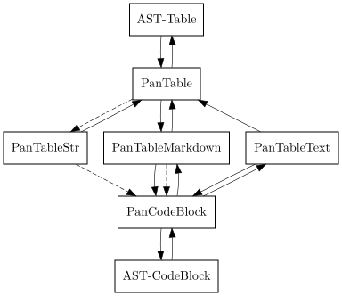
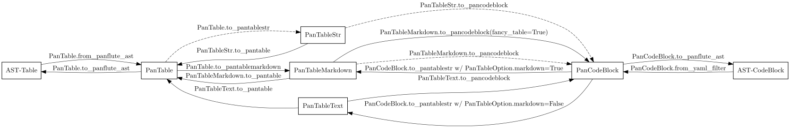

(experimental, API may change in the future)

Documentation here is sparse, partly because the upstream (pandoc) may change the table AST again. See [Crazy ideas: table structure from upstream GitHub](https://github.com/jgm/pandoc-types/issues/86).

The modules are in [`src/pantable/`](https://github.com/ickc/pantable/tree/main/src/pantable).

For example, looking at the source of `pantable` as a pandoc filter, in `codeblock_to_table.py`, you will see the main function doing the work is now

```python
pan_table_str = (
    PanCodeBlock
    .from_yaml_filter(options=options, data=data, element=element, doc=doc)
    .to_pantablestr()
)
if pan_table_str.table_width is not None:
    pan_table_str.auto_width()
return (
    pan_table_str
    .to_pantable()
    .to_panflute_ast()
)
```

You can see another example from `table_to_codeblock.py` which is what `pantable2csv` and `pantable2csvx` called.

Below is a diagram illustrating the API:



Solid arrows are lossless conversions. Dashed arrows are lossy.

You can see the pantable internal structure, `PanTable` is one-one correspondence to the pandoc Table AST. Similarly for `PanCodeBlock`.

It can then losslessly converts between PanTable and PanTableMarkdown, where everything in PanTableMarkdown is now markdown strings (whereas those in PanTable are panflute or panflute-like AST objects.)

Lastly, it defines a one-one correspondence to PanCodeBlock with the [fancy-table](examples/fancy-table.md) syntax.

Below is the same diagram with the method names. You'd probably want to zoom into it to see it clearly.



